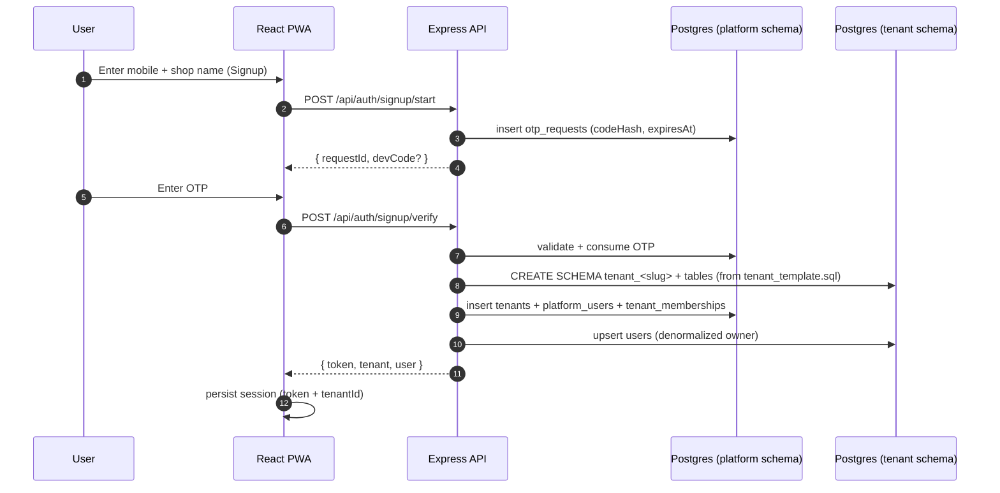

# Multi-Tenancy Architecture

This document explains **how** tenants are isolated, **why** we chose schema-per-tenant, and **what** you need to know to extend the system safely.

---

## 1. Tenancy model: schema-per-tenant (PostgreSQL)

```
PostgreSQL database: tailoring_erp
├── schema: platform              ← global registry (1 schema)
│   ├── tenants
│   ├── platform_users
│   ├── tenant_memberships
│   └── otp_requests
│
├── schema: tenant_acme_tailors   ← shop #1 (1 schema per shop)
│   ├── users
│   ├── customers
│   ├── measurements
│   └── orders
│
├── schema: tenant_bobs_stitching ← shop #2
│   ├── users
│   ├── customers
│   ├── measurements
│   └── orders
│
└── ... one schema per tenant ...
```

### Why schema-per-tenant?

| Strategy                       | Isolation | Ops cost | Cross-tenant query | Backup granularity | Verdict for this ERP |
| ------------------------------ | --------- | -------- | ------------------ | ------------------ | -------------------- |
| Shared DB + `tenant_id` column | Weak (relies on every query filter) | Lowest  | Trivial | Per-row | Risky — one missing `WHERE` leaks data |
| **Schema-per-tenant**          | **Strong (DB-enforced)** | **Medium** | Possible via cross-schema joins | **Per-schema `pg_dump`** | ✅ **Chosen** |
| Database-per-tenant            | Strongest | Highest  | Hard           | Per-DB             | Overkill for SaaS MVP |

Schema-per-tenant gives **Postgres-level isolation** (a query inside `tenant_acme` literally cannot see rows in `tenant_bob` because Prisma is connected with `search_path` set to the tenant schema), without paying the operational cost of a database per shop.

### Trade-offs we accept

- **Many schemas = many migrations.** Adding a column means iterating every tenant schema. We mitigate by keeping the DDL in [`apps/backend/prisma/tenant/tenant_template.sql`](../apps/backend/prisma/tenant/tenant_template.sql) and re-applying additive changes via a migration runner (TODO when needed).
- **Connection pool per schema** in this MVP. For >50 tenants per process, switch to PgBouncer + `SET search_path` per query.

---

## 2. Tenant lifecycle



**Key invariant:** the tenant schema is created **before** the `tenants` row is committed. If schema creation fails, the platform row is never written — no orphaned tenants in the registry.

---

## 3. Tenant resolution on every authenticated request

We use **two independent signals** that must agree. Both are required:

1. **JWT claim** — `tenantId` + `schemaName` are baked into the token at login. The token is the source of truth.
2. **`X-Tenant-Id` header** — the frontend sends this on every API call.

If they don't match, the request is **rejected with 403**. This blocks an entire class of attacks where an attacker captures token A and tries to use it against tenant B by swapping the header.

```ts
// apps/backend/src/middleware/tenantContext.ts
if (headerTenant !== req.auth.tenantId) {
  return next(forbidden('Tenant mismatch between token and X-Tenant-Id'));
}
```

The middleware then:
1. Re-loads the tenant from the platform DB (verifies it still exists + is `ACTIVE`).
2. Confirms `tenant.schemaName === token.schemaName` (defeats a stolen token still being used after a tenant rename / suspension).
3. Attaches `req.tenantDb` — a `PrismaClient` bound to **that tenant's schema only**.

All downstream code uses `req.tenantDb`. It is **physically impossible** for a customer route to accidentally read another tenant's customers, because the Prisma instance is connected to a different schema.

### Why not subdomains?

We chose `X-Tenant-Id` header instead of `acme.yourerp.com` for the MVP because:
- Works on `localhost` with zero DNS configuration
- Easy to test from `curl` / Postman
- No wildcard SSL needed

When you're ready for subdomains, add an Express middleware before `tenantContext` that resolves the subdomain to a `tenantId` and synthesizes the header server-side. The rest of the pipeline stays unchanged.

---

## 4. The per-tenant Prisma client cache

[`apps/backend/src/db/tenantClient.ts`](../apps/backend/src/db/tenantClient.ts) lazily instantiates a `PrismaClient` per schema:

```ts
const url = `${env.DATABASE_BASE_URL}?schema=${schemaName}`;
const client = new PrismaClient({ datasources: { db: { url } } });
cache.set(schemaName, client);
```

- **First request for a tenant** → new pool spun up (a few ms).
- **Subsequent requests** → cache hit, same pool reused.
- **Process shutdown** → all pools `.disconnect()` in parallel.

The schema name passed in is always **validated against a strict regex** (`/^tenant_[a-z0-9_]{1,40}$/`) before being interpolated into the URL or into any raw SQL. This is the only line of defense against SQL injection via tenant names — keep it in mind if you ever loosen the slug rules.

---

## 5. OTP-based authentication

### Storage
- OTPs live in `platform.otp_requests`. Codes are **bcrypt-hashed** — raw codes are never stored.
- Each row tracks `attempts`, `expiresAt`, `consumedAt`.

### Issue flow (`POST /api/auth/(signup|login)/start`)
1. Normalize mobile to E.164 (`+91XXXXXXXXXX`).
2. Throttle:
   - Max **5 requests / hour** per (mobile, purpose).
   - **30-second cooldown** between requests.
3. Generate a cryptographically-random N-digit code (default 6).
4. bcrypt-hash, persist, send via `SmsProvider`.
5. In dev only, echo the code back in the response.

### Verify flow (`POST /api/auth/(signup|login)/verify`)
1. Look up the request by ID; check `mobile`/`purpose`/`expiresAt`/`consumedAt`.
2. Refuse after `OTP_MAX_ATTEMPTS` (default 5) wrong tries.
3. `bcrypt.compare`. On success, mark `consumedAt`.
4. Issue JWT or provision the tenant (signup).

### Why "issue + verify" instead of "send code with username/password"?
- No passwords to leak.
- Reusing the same primitive for both signup and login keeps the codebase tiny.
- Same flow extends naturally to "add a manager" — invite their mobile, they OTP in.

### Plugging in a real SMS provider

Implement `SmsProvider` and register it in [`providers/index.ts`](../apps/backend/src/modules/otp/providers/index.ts):

```ts
export class TwilioSmsProvider implements SmsProvider {
  readonly name = 'twilio';
  async sendOtp(mobile: string, code: string) { /* call Twilio */ }
}
```

Then set `SMS_PROVIDER=twilio` in `.env` and add the relevant API key envs.

---

## 6. Data model summary

### Platform schema (global)
| Table                | Purpose |
| -------------------- | ------- |
| `tenants`            | The shop registry. One row per tenant; `schemaName` = where its data lives. |
| `platform_users`     | Mobile-keyed identities. ONE mobile = ONE platform user (can belong to multiple tenants). |
| `tenant_memberships` | Many-to-many between `platform_users` and `tenants` + role. |
| `otp_requests`       | Issued OTPs (hashed). Lives globally because OTPs are needed BEFORE the tenant exists at signup. |

### Tenant schema (per shop)
| Table          | Purpose |
| -------------- | ------- |
| `users`        | Denormalized membership inside the tenant for fast joins (no cross-schema lookups). |
| `customers`    | Shop's customer list. |
| `measurements` | JSON measurement profiles per customer. |
| `orders`       | Tailoring orders + status. |

---

## 7. Adding a new tenant-scoped table

1. Add the model to `apps/backend/prisma/tenant/schema.prisma`.
2. Add the matching `CREATE TABLE` to `apps/backend/prisma/tenant/tenant_template.sql` (with `__SCHEMA__` prefixes and `IF NOT EXISTS`).
3. Run `npm run tenant:generate --workspace apps/backend` to refresh the client types.
4. For **existing** tenants, write a one-off migration script that loops `SELECT schema_name FROM platform.tenants` and runs the additive DDL on each. Stash these in `apps/backend/prisma/tenant/migrations/NNN_<name>.sql`.

> Until you build a versioned tenant-migration runner, prefer **additive-only** changes (new columns, new tables). Destructive changes need a maintenance window.

---

## 8. Security checklist

- ✅ OTPs are hashed (bcrypt), never stored plaintext, never logged in production.
- ✅ Rate-limited OTP issue (cooldown + hourly cap) — blocks SMS-pumping abuse.
- ✅ JWT + header dual-signal tenant resolution — blocks cross-tenant token replay.
- ✅ Strict schema-name regex — blocks SQL injection via tenant slugs.
- ✅ `helmet`, CORS allow-list, global rate limiter.
- ⬜ TODO before prod: rotate `JWT_SECRET` via secret manager, refresh tokens, audit log table per tenant, per-tenant DB user with `USAGE` only on its own schema.

---

## 9. Mental model in one paragraph

> **The platform schema is the front desk; tenant schemas are the private offices.** The OTP flow proves you own a mobile number, the front desk binds that mobile to a tenant and hands you a JWT keycard. Every subsequent request shows the keycard AND the office number — the middleware checks they match, then opens the door using a connection pool dedicated to that office. Inside the office, your queries can only see that office's data — not because the code remembered to filter, but because the database literally won't return anything else.
